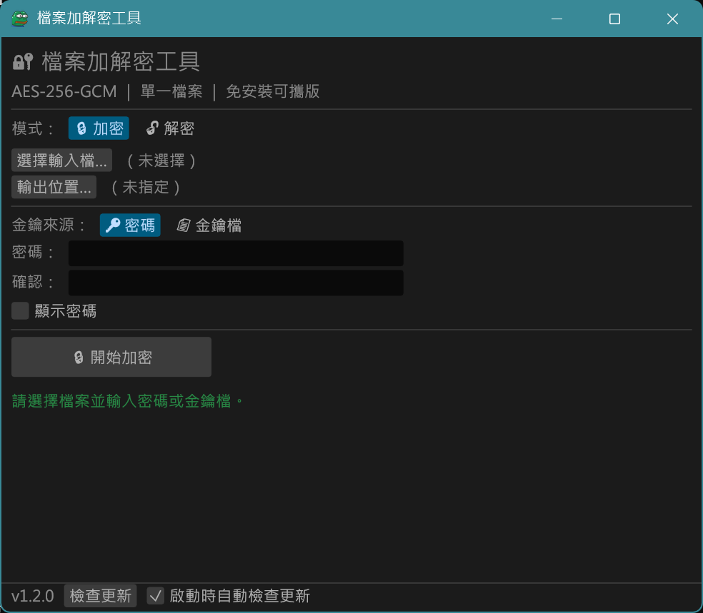

# 檔案加解密工具（Rust + egui）

[](https://github.com/tntrock/file-crypto/actions/workflows/ci.yml)
[](https://github.com/tntrock/file-crypto/releases/latest)
[](LICENSE)

一個 Windows 桌面 GUI 工具，用來對**單一檔案**做加密與解密。
介面純中文、免安裝、可攜。

<p align="center"></p>

## 📥 下載

到 [Releases](https://github.com/tntrock/file-crypto/releases/latest) 下載 `file-crypto-vX.Y.Z-windows-x64.exe`，雙擊即可執行，不需安裝。

每個 exe 都由 GitHub Actions 從原始碼自動建置，並附上 `.sha256` 檔供驗證：

```powershell
Get-FileHash .\file-crypto-v1.2.0-windows-x64.exe -Algorithm SHA256
```

> 首次執行時 Windows SmartScreen 可能會警告「無法辨識的應用程式」，這是因為 exe 沒有程式碼簽章。點「其他資訊 → 仍要執行」即可。

## ✨ 功能特色

- **加密演算法**：AES-256-GCM（AEAD，含完整性驗證，防竄改）
- **金鑰衍生**：Argon2id（64 MiB / 3 iterations / 平行度 1），抗暴力破解
- **串流分塊加密**：以 1 MiB 分塊處理，支援 GB 等級大檔，不吃爆記憶體
- **兩種金鑰來源**：使用者密碼 **或** 金鑰檔（任何檔案皆可當金鑰，以串流雜湊處理，再大的檔案也不佔記憶體）
- **檔名也加密**：原始檔名存在加密內容裡，`.enc` 檔可以任意改名，解密時自動還原
- **絕不毀損既有檔案**：先寫入暫存檔，成功才改名成正式檔名；密碼錯誤、檔案損毀或取消時，不會動到任何既有檔案
- **進度顯示 + 取消**：即時進度條，可中途取消
- **新版提示**：啟動時自動檢查 GitHub 上是否有新版本（可關閉），也可以手動檢查
- **單一 exe**：複製即用，可放在隨身碟

## 🧪 使用步驟

### 加密
1. 選擇「🔒 加密」，點「選擇輸入檔…」。
2. 輸出位置預設為 `原檔名.enc`，可按「輸出位置…」更改。
3. 選金鑰來源：輸入兩次密碼，或選擇金鑰檔。
4. 按「開始加密」。

### 解密
1. 選擇「🔓 解密」，點「選擇輸入檔…」挑選 `.enc` 檔。程式會自動切換成加密時使用的金鑰來源。
2. 輸出位置預設為**同一資料夾、使用原始檔名**；若已有同名檔案，會自動存成 `名稱 (1).副檔名`，不會覆蓋。
   也可以按「輸出位置…」指定檔案；指定的檔案已存在時會先詢問是否覆蓋。
3. 輸入密碼或選擇金鑰檔，按「開始解密」。

## 🔔 檢查更新

- 視窗最下方有「檢查更新」按鈕，以及「啟動時自動檢查更新」選項（預設開啟）。
- 發現新版本時，視窗上方會出現提示，按「前往下載」會用瀏覽器開啟該版本的 Release 頁面。
- **只會提示，不會自動下載或替換程式**：請自行下載，並用 `.sha256` 檔驗證。
- 檢查時只會向 `api.github.com` 查詢最新版本號，不會傳送任何檔案或密碼。但 GitHub 會看到你的 IP 位址；若希望程式完全不連網，請取消勾選自動檢查。
- 設定儲存在 `%APPDATA%\file-crypto\settings.ini`。

## 🔒 安全設計

- **認證式加密**：AES-256-GCM 為業界標準的 AEAD。密碼/金鑰錯誤或檔案遭竄改時，解密會直接失敗，不會輸出錯誤的明文。
- **標頭受保護**：整段標頭（版本、金鑰來源、Argon2 參數、salt、nonce）作為每個分塊的附加驗證資料（AAD），竄改任何一個位元組都會解密失敗。
- **隨機 salt 與 nonce**：每次加密都重新產生；相同檔案、相同密碼，每次的密文都不同。
- **STREAM 分塊**：採用 STREAM（BE32）建構，每個分塊各自帶驗證標籤，可偵測分塊被重排、刪除或截斷。
- **不信任輸入檔**：解密前會檢查標頭參數的上限（避免惡意檔案耗盡記憶體），並把還原的檔名淨化為單純檔名（避免 `..\` 或絕對路徑把檔案寫到其他位置）。
- **敏感資料清除**：衍生出的金鑰與明文緩衝區使用後以 `zeroize` 清零。

> ⚠️ **請務必牢記密碼，並備份好金鑰檔。** 本工具沒有任何後門或救援機制，遺失即無法解密。

## ⚠️ 已知限制

- **本工具未經專業安全稽核。** 設計上使用成熟的密碼學套件（RustCrypto），但請自行評估是否適合你的用途。
- **金鑰檔必須逐位元組相同。** 任何檔案都能當金鑰檔，但只要內容有一點改變（例如圖片被重新存檔、被修改中繼資料），就再也無法解密。建議使用不會變動的檔案，並另外備份。
- **不能同時使用密碼和金鑰檔。**
- **`.enc` 檔名本身不加密。** 預設輸出名稱是 `原檔名.enc`；若不想透露檔名，請自行把 `.enc` 檔改名（解密時仍會還原原始檔名）。
- **輸入框中的密碼**由 GUI 框架管理，無法保證在記憶體中被完全清除。
- **只支援 Windows**（介面字型取自 Windows 系統字型）。

## 📄 加密檔格式

目前版本為 **v2**（v1.1.0 起）。所有整數為小端序。

| 位移 | 長度 | 欄位 |
|---:|---:|---|
| 0 | 6 | Magic = `RFENC1` |
| 6 | 1 | 格式版本（2） |
| 7 | 1 | 演算法（1 = AES-256-GCM / STREAM BE32） |
| 8 | 1 | 金鑰來源（0 = 密碼、1 = 舊式金鑰檔、2 = 金鑰檔雜湊） |
| 9 | 4 | Argon2 m_cost（KiB） |
| 13 | 4 | Argon2 t_cost（迭代次數） |
| 17 | 4 | Argon2 p_cost（平行度） |
| 21 | 1 | Salt 長度（16） |
| 22 | 16 | Salt |
| 38 | 7 | STREAM nonce 前綴 |
| 45 | … | 加密分塊（每塊 = 明文 1 MiB + 16 位元組驗證標籤，最後一塊可較短） |

- 位移 0–44 的標頭作為每個分塊的 AAD。
- 加密前的明文串流為：`原始檔名長度 (u16)` + `原始檔名 (UTF-8)` + `檔案內容`。
- 金鑰 = Argon2id(輸入, salt)，長度 32 位元組。依金鑰來源，Argon2 的輸入為：
  - `0`（密碼）：密碼的 UTF-8 位元組
  - `2`（金鑰檔，v1.2.0 起）：金鑰檔的 BLAKE2b-512 雜湊值（串流計算）
  - `1`（舊式金鑰檔，v1.1.0 以前）：金鑰檔的完整內容；僅用於解密舊檔

### 版本相容性

| 格式 | 產生版本 | 新版可否解密 | 差異 |
|---|---|---|---|
| v2 | v1.1.0 起 | ✅ | 標頭受驗證、檔名加密（v1.2.0 起金鑰檔改用雜湊，見下方說明） |
| v1 | v1.0.0 – v1.0.1 | ✅ | 標頭未受驗證，原始檔名以明文存在標頭 |

新版一律產生 v2 檔案；舊版程式無法解密 v2 檔案。解密 v1 檔案時程式會提示，建議解密後重新加密。

**金鑰檔加密的檔案**：v1.2.0 起改用金鑰檔的雜湊值（金鑰來源 `2`），所以 v1.2.0 以後用金鑰檔加密的檔案，v1.1.0 無法解密；用密碼加密的檔案則不受影響。新版仍可解密舊版用金鑰檔加密的檔案。

## 🛠️ 從原始碼建置

### 前置需求
- 安裝 [Rust 工具鏈](https://rustup.rs/)（含 `cargo`）。
- MSVC 工具鏈需要 Windows SDK 的 `rc.exe` 來嵌入 exe 圖示（安裝 Visual Studio Build Tools 即內含）；GNU 工具鏈則需要 MinGW-w64。

### 在 Windows 上編譯
```powershell
git clone https://github.com/tntrock/file-crypto.git
cd file-crypto
cargo build --release
```
產物：`target\release\file-crypto.exe`

### 從 Linux / macOS 交叉編譯
```bash
rustup target add x86_64-pc-windows-gnu
cargo build --release --target x86_64-pc-windows-gnu
```
產物：`target/x86_64-pc-windows-gnu/release/file-crypto.exe`
（需安裝 MinGW-w64；Debian/Ubuntu：`sudo apt install mingw-w64`）

### 執行測試
```powershell
cargo test
```
測試涵蓋加解密往返、分塊邊界、竄改與截斷偵測、失敗時不毀損既有檔案、惡意標頭、金鑰檔，以及舊檔相容性。

## 🚀 發佈新版本

1. 修改 `Cargo.toml` 的 `version`（例如 `1.1.1`）並合併到 `main`。
2. 推送同名 tag：
   ```bash
   git tag -a v1.1.1 -m "v1.1.1"
   git push origin v1.1.1
   ```
3. GitHub Actions 會自動跑測試、編譯 exe、計算 SHA-256，並上傳到同名的 Release。若 tag 與 `Cargo.toml` 版本不一致，建置會失敗。

## 🎨 更換應用程式圖示

- **EXE 檔案圖示**（檔案總管）：`build.rs` 透過 `winresource` 把 `assets/icon.ico` 嵌入 exe。
- **視窗圖示**（標題列／工作列）：`main.rs` 讀取 `assets/icon.png`。

替換這兩個檔案即可：`icon.ico` 建議包含 256/48/32/16 多種尺寸，`icon.png` 建議 256×256。

## 📁 專案結構
```
file-crypto/
├─ .github/workflows/
│  ├─ ci.yml         # push／PR 時執行格式檢查、clippy、測試
│  └─ release.yml    # 推送 v* tag 時建置 exe 並發佈
├─ assets/
│  ├─ icon.ico       # exe 檔案圖示（多尺寸）
│  └─ icon.png       # 視窗／工作列圖示（256×256）
├─ docs/
│  └─ screenshot.png
├─ src/
│  ├─ main.rs        # 進入點、視窗設定、載入視窗圖示
│  ├─ app.rs         # egui GUI 介面與背景工作執行緒
│  ├─ crypto.rs      # AES-256-GCM + Argon2id 核心、檔案格式與單元測試
│  └─ update.rs      # 檢查新版本與使用者設定
├─ tests/fixtures/
│  ├─ v1_sample.enc          # v1 格式範例檔（密碼）
│  ├─ v2_keyfile_legacy.enc  # v1.1.0 以舊式金鑰檔加密的範例檔
│  └─ keyfile.bin            # 上面範例檔使用的金鑰檔
├─ build.rs          # 建置腳本：嵌入 exe 圖示與版本資訊
├─ Cargo.toml
└─ Cargo.lock
```

## 📜 授權

[MIT License](LICENSE)
